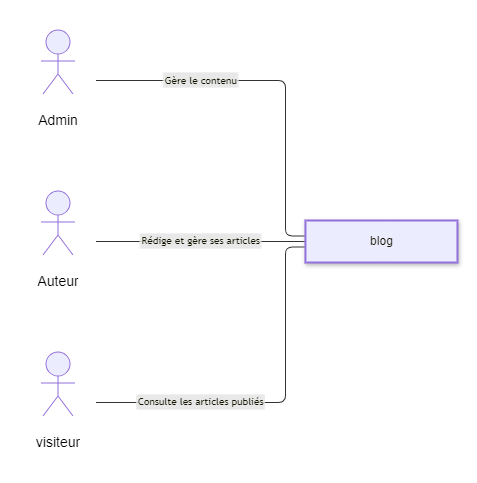

1️⃣ Nom du système
---
Plateforme de Podcasting

2️⃣ Acteurs et leurs objectifs
Acteur	Objectif
---
Administrateur	Gérer les podcasts et les utilisateurs
Podcasteur	Créer et publier des podcasts
Visiteur	Consulter et écouter les podcasts

3️⃣ Diagramme de contexte

---
